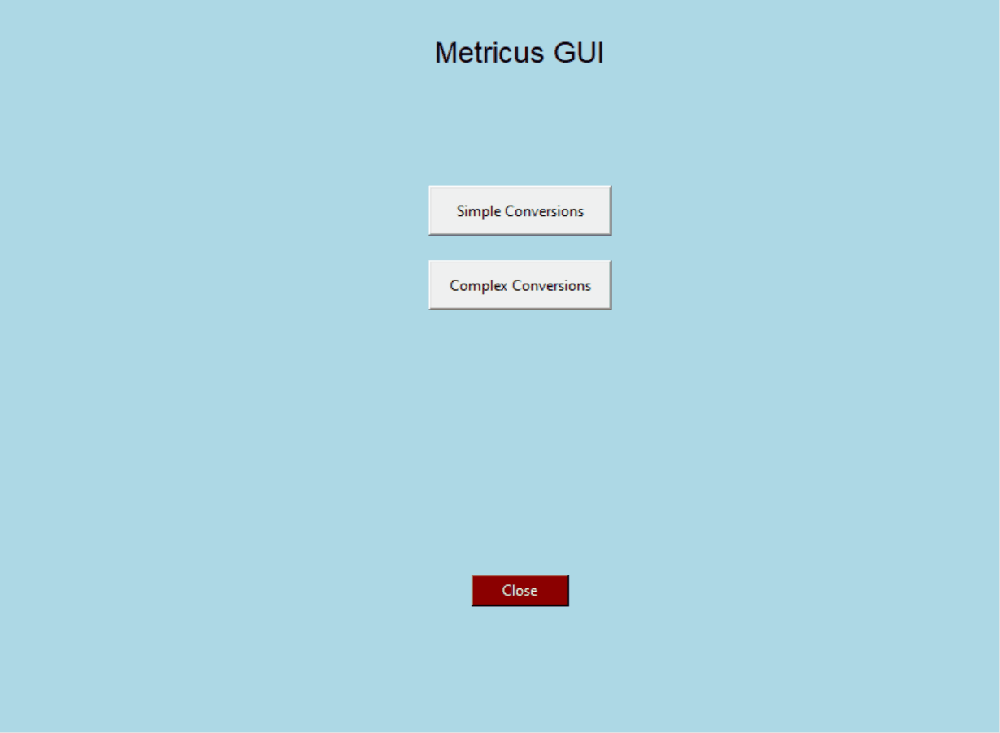

<h1 align="center" style="font-weight: bold;">Metricus</h1>

[](https://www.python.org/)
[](https://pypi.org/project/pip/)
[](https://github.com/Naereen/badges/)

<p align="center">
 <a href="#started">Getting Started</a> • 
 <a href="#colab">Collaborators</a> •
 <a href="#contribute">Contribute</a> •
 <a href="#license">License</a> •
 <a href="#preview">Preview</a>
</p>

<p align="center">
  <b>This Python-based unit converter is a simple and efficient tool for converting measurements between various units, such as force, length, mass, and others, including complex operations like displacement. It features an intuitive graphical user interface built with Tkinter, allowing users to navigate and perform conversions easily. The converter returns precise results, formatted with or without the unit abbreviation for easy readability.
  </b>
</p>

<h2 id="started">🚀 Getting started </h2>

```bash
pip install metricus
```

### Usage Example
```python
from Metricus.gui import MetricusGUI
from Metricus import temperature_converter
from Metricus.utilities import round_number, humanize_input, decomputarize_input

# Converting temperatures
temp_celsius = 25
temp_rankine = temperature_converter(temp_celsius, 'celsius', 'rankine')
print(f"{temp_celsius} degrees Celsius equals {temp_rankine} Rankine")

# Rounding a result
time_days = 365
time_result = time_converter(time_days, 'day', 'year')
rounded_number = round_number(time_result)
print(f"The number {time_result} rounded is {rounded_number}")

# Rounding a str result 
time_result = time_converter(time_days, 'day', 'year', with_unit=True)
rounded_number = round_number(time_result)
print(f"The number {time_result} rounded is {rounded_number}")

# Humanizing input
from_acceleration = 'Meter per second squared'
to_acceleration = 'Foot per second squared'
acceleration_result = acceleration_converter(100, humanize_input(from_acceleration), humanize_input(to_acceleration))
print(f"The conversion result from {from_acceleration} to {to_acceleration} is {acceleration_result}")

# Decomputadorize input
decomputarized_from = decomputarize_input(humanize_input(from_acceleration))
decomputarized_to = decomputarize_input(humanize_input(to_acceleration))
print(f"The decomputarized input from '{humanize_input(from_acceleration)}' is '{decomputarized_from}'")
print(f"The decomputarized input to '{humanize_input(to_acceleration)}' is '{decomputarized_to}'")

# Initializing and running the graphical interface
MetricusGUI()
```

<h2 id="preview">🌟 Preview</h2>

Below is a preview of the Metricus graphical user interface (GUI):
<p align="center">Simple Conversions:</p>
<p align="center">
  
</p>
<p align="center">Complex Conversions:</p>
<p align="center">
  
</p>

The GUI is built with Tkinter and provides an intuitive way to perform unit conversions quickly and accurately.

<h3>Prerequisites</h3>

- Python 3.8+
- Tkinter (included in Python's standard library)

<h3>Cloning</h3>

```bash
git clone https://github.com/guifreschi/Metricus
```

<h3>Starting</h3>

Clone the repository
git clone https://github.com/guifreschi/Metricus

Navigate into the project directory
cd Metricus

Create a virtual environment
python -m venv venv

Activate the virtual environment
- On Windows
venv\Scripts\activate
- On Unix or MacOS
source venv/bin/activate

Install Metricus
pip install -e .

<h2 id="colab">🤝 Collaborators</h2>

This project is maintained and created by:

<table>
  <tr>
    <td align="center">
      <a href="https://github.com/guifreschi">
        <br>
        <sub>
          <b>Guilherme Freschi</b>
        </sub>
      </a>
    </td>
    <td align="center">
      <a href="https://github.com/YaronBuchler">
        <br>
        <sub>
          <b>Yaron Buchler</b>
        </sub>
      </a>
    </td>
  </tr>
</table>

<h2 id="contribute">📫 Contribute</h2>

1. `git clone https://github.com/guifreschi/Metricus`
2. `git checkout -b feature/NAME`
3. Follow commit patterns
4. Open a Pull Request explaining the problem solved or feature made, if exists, append screenshot of visual modifications and wait for the review!

<h3>Documentations that might help</h3>

[📝 How to create a Pull Request](https://www.atlassian.com/br/git/tutorials/making-a-pull-request)

[💾 Commit pattern](https://gist.github.com/joshbuchea/6f47e86d2510bce28f8e7f42ae84c716)

<h2 id="license">📝 License</h2>

This project is licensed under the MIT License. See the [LICENSE](LICENSE) file for details.
